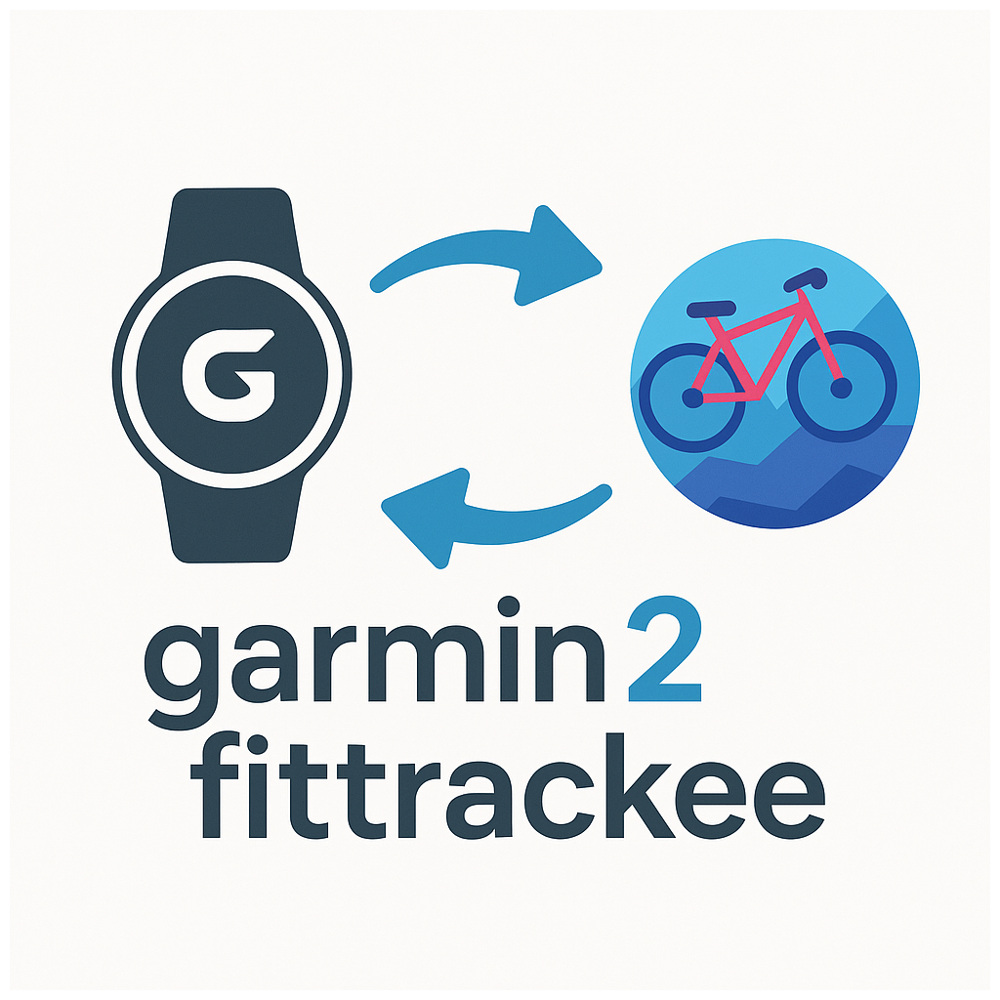

# garmin-to-fittrackee

A simple script to synchronize garmin to fittrackee. Inspired by https://github.com/jat255/strava-to-fittrackee



Thank to [Thovi98](https://github.com/Thovi98) for image.

[Github repository](https://github.com/Dryusdan/garmin-to-fittrackee) is a mirror of [git.dryusdan.fr](https://git.dryusdan.fr/Dryusdan/garmin-to-fittrackee)

## How to install it

This script is a CLI to interact download activity with GPX on Garmin and push it into Fittrackee.

This program uses the `garminconnect` package to interact with Garmin and `Typer` to provide a CLI. Also, it uses sqlite3 to keep which Garmin activity matches a Fittrackee workout with the aim of modifying Fittrackee sessions if new features appear.

This program is developed around Fittrackee v0.7.29 and works with it. It works on Python 3.12, 3.11 and 3.10 (minimal version required) but is actively developed on Python 3.11. It only runs on Linux. Other OS isn't tested.

### To install it

With official pypi :
```bash
pip install garmin-to-fittrackee
```

With git.dryusdan.fr pypi repository :
```bash
pip install --upgrade --index-url https://git.dryusdan.fr/api/packages/Dryusdan/pypi/simple/ --extra-index-url https://pypi.python.org/simple garmin-to-fittrackee
```

With source code

```bash
pip3 install poetry
git clone https://git.dryusdan.fr/Dryusdan/garmin-to-fittrackee.git
cd garmin-to-fittrackee
poetry install
```

## Environment variables

Some paths can be overridden with environment variables. They all have sensible defaults.

| Variable | Default | Description |
|----------|---------|-------------|
| `CONFIG_PATH` | `~/.config/garmin-to-fittrackee` | Directory where the configuration files are stored (`config.yml`, `garmintoken/`, `fittrackee.yml`, `garmin.yml`). |
| `DATABASE_PATH` | `~/.local/share/garmin_to_fittrackee` | Default value for the `setup config-tool --database-path` option, where the `db.sqlite3` database is created. |
| `TMP_PATH` | `/tmp` | Directory where downloaded Garmin activity files are temporarily written. |

## How to use it

### Setting your fittrackee instance Oauth2 application

You need to set an application in your Fittrackee instance.

Go to your fittrackee account, then go to "apps", then "Add an application".

In the "Add a new OAuth2 application" section, choose your `Application name`.

To `application URL` and `Redirect URL` set this URL `https://localhost` (useful for configuration, later in this README).

In Scope, check `equipments:read`, `equipments:write`, `geocode:read`, `media:write`, `profile:read`, `profile:write`, `users:read`, `users:write`, `workouts:read`, `workouts:write`.

> Note: the CLI requires a broader scope. When you run `setup fittrackee`, it displays the exact scope to check. You can safely check all the following scopes in your Fittrackee application: `equipments:read`, `equipments:write`, `media:write`, `profile:read`, `profile:write`, `workouts:read`, `workouts:write`.

After submitting your application, an application ID and secret are displayed. These information are useful for setting the CLI, note these down.
And that's all for Fittrackee.

The first time, you need to run 3 commands :

```bash
garmin2fittrackee setup config-tool
```
This command sets the configuration, default log level ("INFO"), default path to database.
Use `--help` to view which parameters you can change.

The second command logs in to Garmin. The client asks for your Garmin's credentials :

```bash
garmin2fittrackee setup garmin
```
You can save these credentials with `--store`. You can set these parameters in cli argument. See `--help`.

The third command is used to set up the Fittrackee connection.
```bash
garmin2fittrackee setup fittrackee
```

The command asks for your application ID, application secret, the domain of your Fittrackee instance (without `https://`).

Then the CLI will guide you through authorising the application to Fittrackee.
⚠️ Be certain to copy/pasted all the line output (and do not ctrl+click on it). If you do not, the sync will fail. ⚠️
